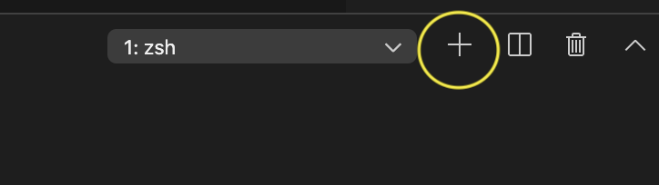

### Steps to creating a blog/recipe post

1. Open up your VS Code application. This is the editor that you use to edit the files and run your "development" server.
2. The application **should** appear automatically in the window if you've opened it before.
   - If that's not working, just go to `file/open` to open a new workspace, and choose the blog folder.

3) Next, you want to run your development server. This let's you see the changes in real-time without having to send them up to the production server. You can do this within VSCode.

   - To open a "terminal" window (we use this to run our server) press `ctrl` and `~` (the tilda character `~` is on the top left of your keyboard). You can also choose 'new terminal' from the Terminal option in your MacOS menubar.
   - You should see a new black window appear at the bottom of the VSCode window. That's your terminal!
   - Click it, and type the following command: `hugo server -D` If you now navigate to http://localhost:1313 in the web browser, you'll see the local version of our website!
   - Back in the terminal, you should see a bunch of output that ends with this line:`Press Ctrl+C to stop` which allows you to shutdown the server. You may need this command later.

4) Now that you have a server running you can technically make a new blog post. But you'll need to open up a new terminal to get the shortcuts. Click the plus icon on the terminal window. It looks like this: 

   - You're now inside a second terminal. This is where you can use the shortcuts to create new posts.
   - You can switch back to the old terminal at any point from the dropdown (if, for example, your server isn't updating, you can turn it off with `Control` and `c` and then run it again with `hugo server -D`)

5) Within your second terminal, you may create a new blog post, or new recipe, with shortcuts.

   - For a new blogpost, type `hugo new blog/the-name-of-the-post.md`
     - Keep in mind, you can always change the name of the post.
   - For a new recipe, type `hugo new recipe/the-name-of-the-recipe.md`
   - These commands allow you to quickly and easily create the skeleton of a new post

6) Look in the `content` folder. You should see a new post created, with a bunch of default information. You can customize the "meta" information at the top of the file to change the blogpost.

   - You write the actual post itself below the post.
   - When you save while you are writing, you should see the page automatically refresh with your changes. If this isn't happening, check your `development server` in the terminal, and restart it if necessary (see step 3)

7) Uploading pictures to your post is easy. Just go to our Google cloud storage site and drag and drop. Then, get the link and add it to the blog post!

8) Once you're happy with the post, you can save the file and upload it to the production server.
   - Go back into your terminal (where you ran the `hugo new` command) and type `./deploy.sh`
   - This tells your machine to build the site and send all of the files up to the production server. You should see a pretty long output. Checkout the website and see your post is live!

### Final notes:

You are writing the blog posts in markup, not HTML, because markdown is far quicker and easier to understand and format. The application automatically converts your writing to markdown and applies styling when you run the `build`step before uploading it to the server. I've included some boilerplate markdown in the default recipe/blogpost template so you can see how to do different things with it. This file is also written in markdown!
